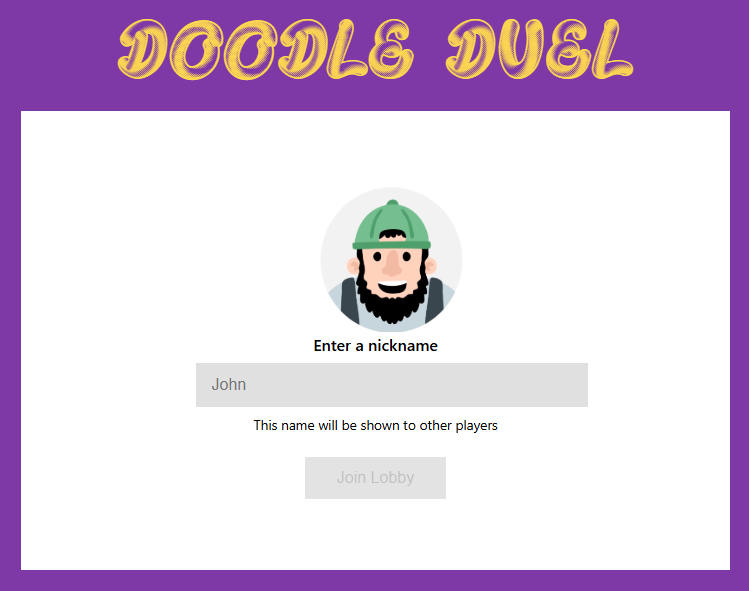
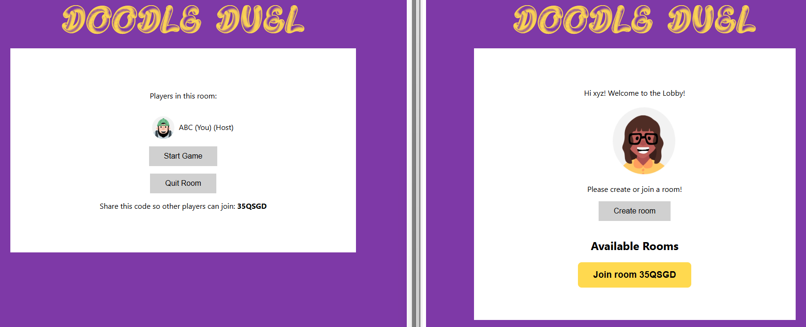
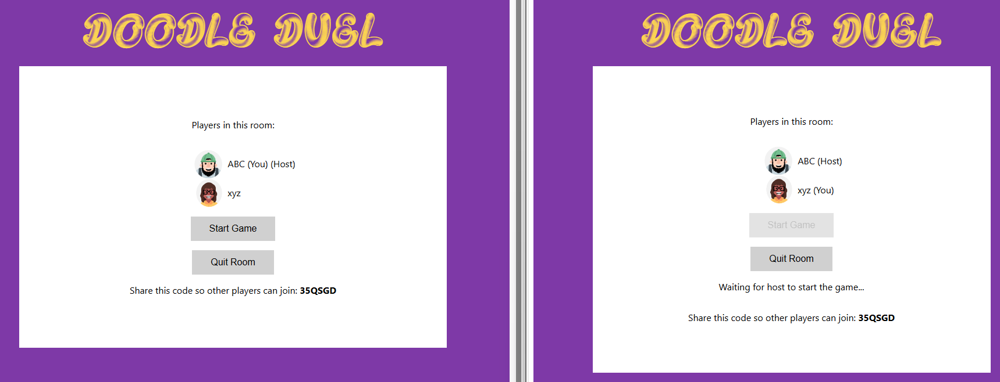
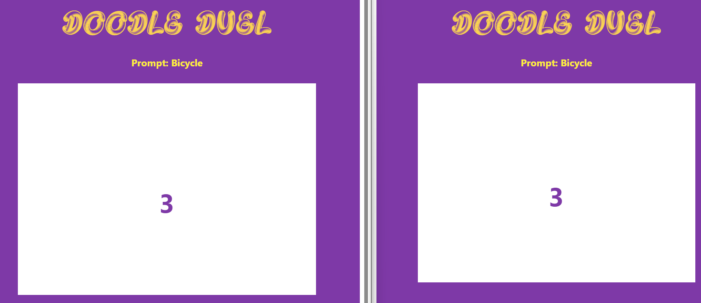
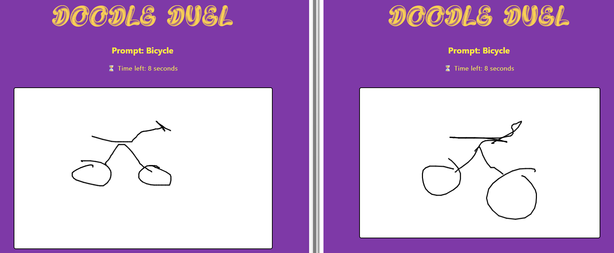
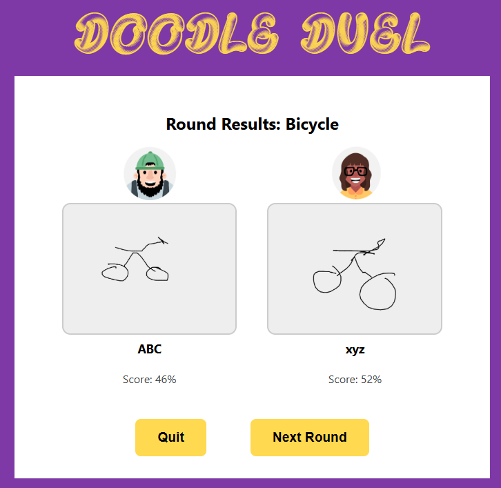

# Doodle Duel Frontend

This is the React frontend for Doodle Duel, a real‑time multiplayer drawing game with AI scoring. It provides the user interface, manages the drawing canvas, and connects to the backend via Socket.IO.

## Features
- Responsive drawing canvas with countdown features
- Real‑time multiplayer connection via Socket.IO
- Lobby and room management with React Router
- Image upload to backend for AI scoring

## Game Flow
1. Landing Page – player chooses a nickname and is given an avatar
<p>

</p>

2. Lobby – players create or join a room
<p>

</p>
<p>

</p>

3. Pre‑countdown – prompt is revealed during a 3‑second countdown
<p>

</p>

4. Canvas – players draw for 30 seconds
<p>

</p>

5. Submission – drawings are uploaded to backend
6. Results – scores and images displayed together
<p>

</p>


## Tech Stack
- React 19 – UI framework
- React Router DOM 7 – client‑side routing
- Socket.IO Client 4 – real‑time communication
- Vite 7 – fast dev server and build tool
- ESLint 9 – linting and code quality

## Folder Structure
```
Frontend/
├── src/
│   ├── Assets/
│   │   ├── Avatars/
│   │   └── Fonts/
│   ├── Components/
│   │   ├── Canvas.jsx
│   │   ├── Header.jsx
│   │   ├── LandingPage.jsx
│   │   ├── LobbyPage.jsx
│   │   ├── ResultsPage.jsx
│   │   └── RoomPage.jsx
│   ├── App.jsx
│   ├── main.jsx
│   ├── socket.js
│   └── styles.css
├── .gitignore
├── eslint.config.js
├── index.html
├── package-lock.json
├── package.json
├── README.md
└── vite.config.js
```

## Installation

1. **Clone your fork**

```bash
git clone <your-fork-url>
cd new-doodle-duel/Frontend
```

2. **Install dependencies**

```bash
npm install
```

## Scripts

```bash
- **npm run fe**  OR  **npm run dev**   # Start local dev server with Vite 
- npm run build     # Build production assets
- npm run preview   #	Preview the production build locally
- npm run lint      # Run ESLint checks
```

Currently, the project is only run in development mode. The build and preview scripts are included for future production deployment.

## Development Setup
The frontend expects the backend services to be running:
- Node.js server on http://localhost:3000
- FastAPI ML server exposed via ngrok (backend writes URL into .env)

When you start the backend (see Backend README), the frontend connects automatically via Socket.IO.